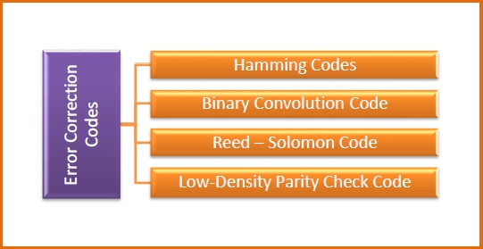
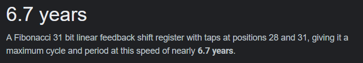

# Applications for LSFR 

## Self Synchronizing scrambler | Multiplicative scrabler

Does not require SYNC word for synchronization unlike synchronous scrambler

Preforms multiplication of input by transfer function in Z-space. Hence AKA multiplcative scrambler

```
Self Synch Scrambler:
       +-> Out
       |
In -> (+) -->[1][2][3][4][5][6][7][8][9][10][11][12][13][14][15]--+
       |                                                  |       |
       +-------------------------------------------------(+)------+

Self Synch descrambler:
In ----+---->[1][2][3][4][5][6][7][8][9][10][11][12][13][14][15]--+
       |                                                  |       |
      (+)------------------------------------------------(+)------+
       |
       +-> Out
```

Defined by polynomial $1 + X^{14} + X^{15}$

```sv
// descrambler logic
// -- missing some way to initialize shift_reg
    always_ff @(posedge clk)
        shift_reg <={shift_reg[14:1], dat_in};
    
    always_comb dat_out = dat_in  ^ shift_reg[15] ^ shift_reg[14];

// scrambler logic
// -- missing some way to initialize shift_reg
    always_ff @(posedge clk)
    if(reset)
        shift_reg <= 'b0;
    else
        shift_reg <= {shift_reg[14:1], dat_out};
    
    always_comb dat_out = dat_in ^ shift_reg[15] ^ shift_reg[14];
```

> Note the only diff is the shift_reg def using dat_out vs dat_in

# Convolutional Encoding / Viterbi Decoding

"first, CS and HW are the most complex and rapidly developing intellectual creations of modern man"

## Origin of Viterbi Decoding

- Andrew J. Viterbi (founder of Wualcomm) 
  - "Error Bounds for Convoluional Codes and an Asympotitcally Optimum Decoding Algorithm" 
  - *IEEE Transactionsn on Information theory*, Volume IT-13, pp. 260-269, April 1967

Old: Block based parity (Haming)




## Termiology
- k: number o fmessage symbols
- 

> TODO: revisit slides and fill in terminology

## Convolutional Encoder
```ditaa{cmd arg=["-E"]}
        +---------------------+
        |                     |
        |                     v
        |         +--------->(+)-----+
        |         |           ^      |
        |         |           |      v
        |         |           |   +---------+
        |  +----+ |  +----+   |   | SEL A/B | --> Output
INPUT --+->| FF |-+->| FF | --+   +---------+
        |  +----+    +----+   |      ^
        |                     v      |
        |                    (+)-----+
        |                     ^
        |                     |
        +---------------------+
```
- SEL block gets triggered on both posedge and negedge of clk
- Input: k bits/sec
- Output: n=2k symbols/sec
- Rate: r = 1/2
- K = 3 (7, 5)
  - octal numbers represent generator polynomials
    - 7=111
    - 5=101
- m = 2

Encoding Example: 

- Both FF set to 0 initially
- Inp: `010111001010001`
- Out: `00 11 10 00 01 10 01 11 11 10  00 10 11 00 11`


Flush Encoder by clocking (m=2) times with 0 inputs

## Problem Formulation

> TODO: revisit slides

## The Noisy Channel Model

```
src --> {noisy channel} --> noisy msg ---> {decoder} ---> guess orig msg
```

## Characteristic

> TODO: revisit slides


