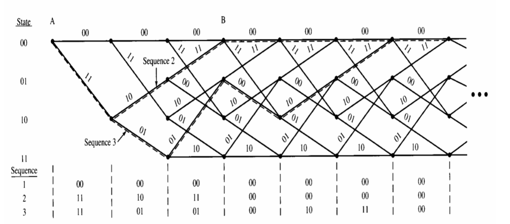

Recursive Convolutional Encoder Help
```
                             Input (1)
                       (3)     v
 +-----> [curr state] --/--> [C1] ---+
 |                       \-> [C2] ---+----> Output
 |                                   |
 +-----------------------------------+
```
- `C1(curr_state[2:0], input[0]) --> next_state`
- `C2(curr_ztate[2:0], input[0]) --> output`

> Hint: Get it to work with testbench. Just write the case statement first.THEN go to quartus and get the RTL viewer (hardware map). This will make it obvious how it works

> Recall how you did LSFR & non-recursive conv encoder (hw7). This is combining logic from both!

2 things to know to make Viterbi work
1. Inner machination of Encoder
2. Starting State for both Encoder and decoder

Modelsim's Format:Analog is useful. In CSE141L (processor design), used for checking ProgCtr to check for loops

ACS
- Add: costs together 
- Compare: against original data (Hamming Distance basically)
- Select: the more likely branch

`Conv_Env_Dec.pptx:22`


> Note: notice how possible outputs are always complementary 

1. Figure out Encoder (`encoder.sv:20`) logic
2. Look at `instructions.doc` tables to figure out combinational logic for ACS, BCM, TBU